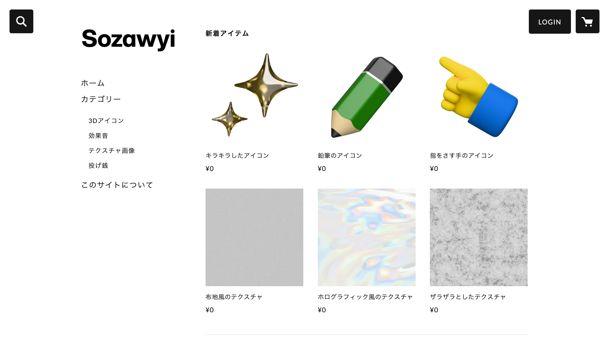
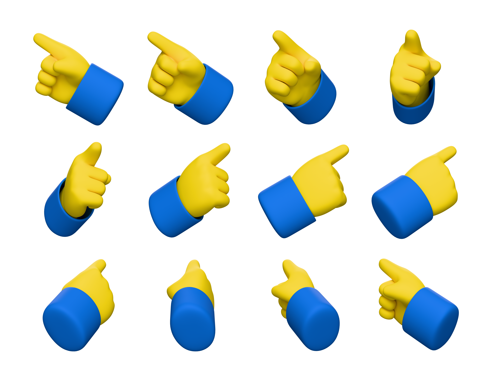
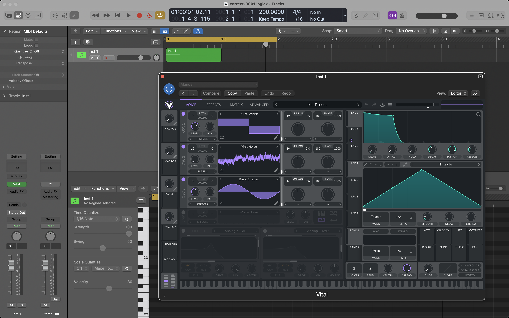

[Sozawyi](https://sozawyi.stores.jp/)

2025年6月にリリースしました。
リリース当初現在、以下の素材を販売しています。

- 3Dアイコン
- 効果音
- テクスチャ画像

## 作った経緯

以下の2つの考えがあり、それらを実現するためにこのサイトを作りました。

- 色々なジャンルのものを作れる制作スキルがあるので、それらを1箇所でまとめて提供したら便利なのではないか
- 値段を決めず、後払いな販売サイトがあっても良いのではないか

### 色々なジャンルの制作

私の制作スキルは、UI・2Dグラフィック・3Dグラフィック・動画・音楽など比較的幅広いジャンルをカバーしています。

1人の人間で作れるという特性上、どのジャンルのものでも統一感を出しやすいです。

色々なジャンルの素材がありつつ、テイストも統一されているサイトがあったとしたら、便利に思ってくれる人がいるのではないか？と考えて制作しました。

### 後払いなサイト

私自身、フリー素材のサイトを使うことはあります。

そのときに思うのは「直近でかなりお世話になったし、直接的にお金を支払えたら良いのに」といったことです。

広告などで間接的な収入を得ているサイトも多いとは思いますが、もっと直接的に払えた方が製作者の方の利益に繋がるはずです。

日頃、素材を使う側としてこういった考えでいたので、提供する側にまわろうと思ったときに「基本は無料・しかし内容が良かったら後からでもお金を支払える」という仕組みにしようと決めました。

## 技術選定の理由

最初は特に何も考えず、カートや決済・素材ファイルダウンロードの仕組みなどを自分で作ろうとしていました。

ただ、調べれば調べるほど難易度の高さを実感しました。

サイト構築や運用そのものに時間をかけすぎて、素材自体の制作に手が回らなくなってしまっては意味がありません。  
そのため、外部サービスを使うことに決めました。

サービス選定をしていた際の要件はこちらです。

- デジタルコンテンツを販売できるか
  - 画像だけでなく、音声や動画なども販売できるか
- コンテンツをユーザーが購入した際、その場でダウンロードできるか
- Pay what you wantのような仕組みを実現できるか
- 無料のプランから始められるか
- サイトの見た目をカスタムできるか

いくつかの候補はありましたが、最終的には[STORES](https://stores.fun/)を使うことにしました。

サイトの見た目のカスタムがあまりできないのと、そっくりそのままのPay what you wantではありませんでしたが、他の要件は満たしていたため、STORESを選びました。

## 素材の制作

### 3Dアイコン

3Dアイコンは、[Blender](https://www.blender.org/)を使って制作しています。

複数のアイコンを同じグラフィックの中に並べても違和感が無いように、ライトの位置や数、カメラの位置などを固定してテンプレート化しています。

また、せっかく3Dなので色々な向きのアイコンを作っています。  
1種類のアイコンにつき12種類、どのアイコンでも同じだけの回転をするように設定して書き出しています。

### 効果音

効果音は、シンセサイザーを利用して作っていることが多いです。

[Vital](https://vital.audio/)や[Serum 2](https://xferrecords.com/products/serum-2)を使って、ワンショットな効果音を作っています。

趣味レベルですが音楽制作もしていて、シンセサイザーで音作りもするのですが、そのときに不意に効果音っぽい音が生まれることもあります。

そういったものを再利用しているイメージです。

### テクスチャ画像

テクスチャ画像はBlenderや[After Effects](https://www.adobe.com/jp/products/aftereffects.html)を使って制作しています。

ノードを組んだりエフェクトを重ねたりしていると、グラフィックデザインで使えそうなエフェクトが生まれることもあります。

そういったものを再利用しているイメージです。

同じテクスチャでも、パラメーター違いでいくつかのバリエーションを作って配布しています。

